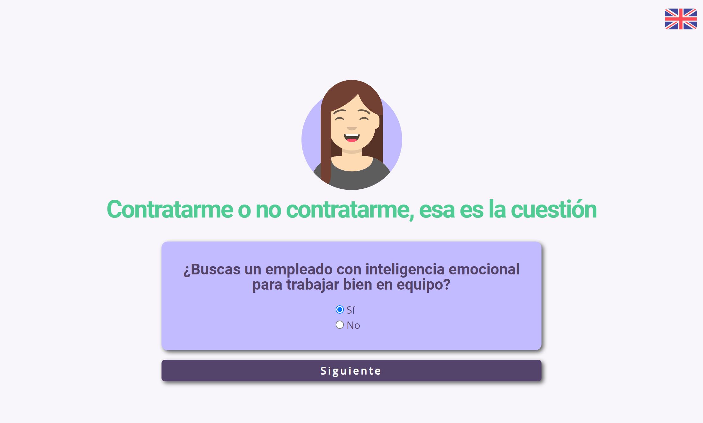
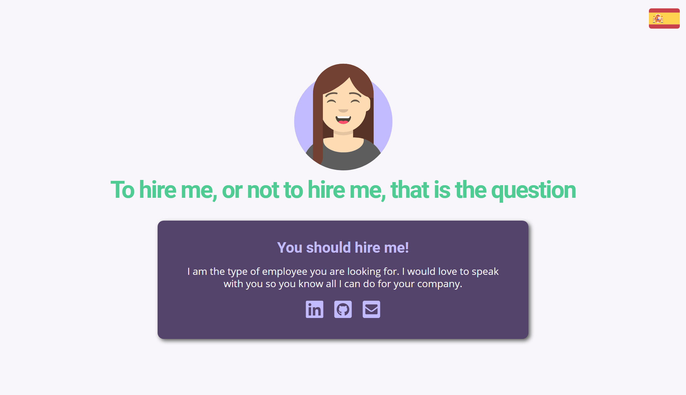

# Hiring Test
Un divertido test para seguir desarrollando los conocimientos adquiridos HTML, CSS, SCSS y JS y ponerlos en práctica de una manera diferente y original. Puedes realizar el test [pulsando aquí](https://nurimartinez.github.io/hiringtest/).

  
  

Descripción
-------------
* Página web con diseño responsive.
* Estructura semántica del HTML.
* Traducción del contenido a inglés y español.

Características
-------------
* HTML5
* CSS3
* JS
* SASS
